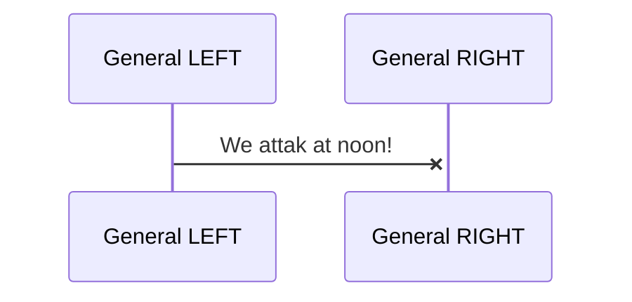
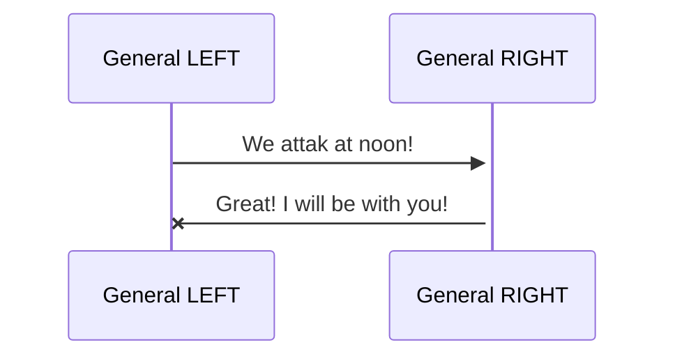
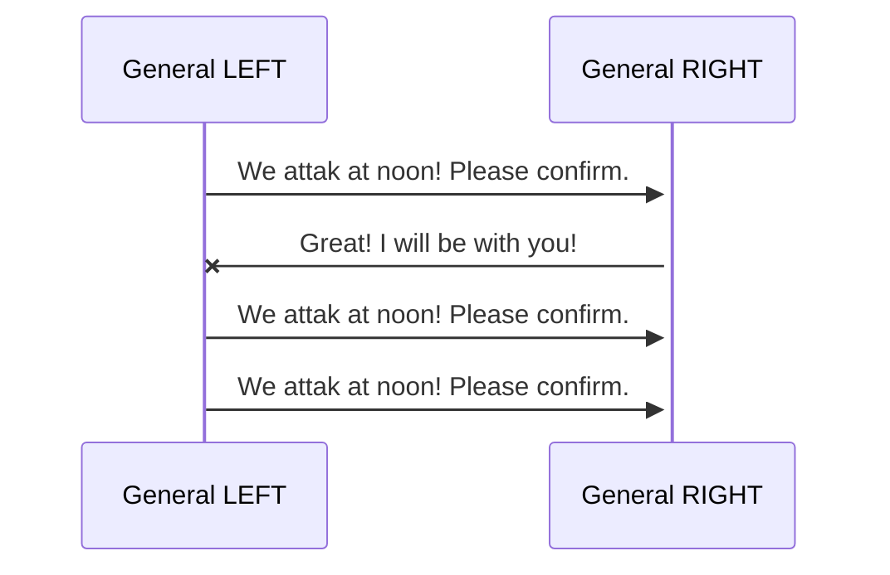

# The two generals - The problem

> [!NOTE]
> inspired by https://blog.bulloak.io/post/20200910-two-generals-problem/

Two armies (red and blue). The blue one is in a vally and on opposite mountains the red one is deployed with one general for ervery mountain side.

**Goal:** red must start one combined attak of blue to win

**Problem:** how to establish a secure communication between these two generals / armies to be sure both armies attak at the same time

The communication only works with messengers, which must be send through the hostile valley.

**Risk:** messengers could be caught, compromised, exchanged, ...


**How should the protocol look like to ensure the communication went through?**

## Examples

Keep in mind that the two-generals-methaphor is used to give a better understanding of **the underlying problem - how to establish 'exactly once delivery'?**

How can the participants be sure about a common knowledge[^1] (how / when to attak the enemy)) in distributed systems? With more than one participant there are probably more than one truth / observation.

## How can the generals be sure, that the messeges went through?




## What, if an answer is expected but never received?


## Try for yourself to find an answer

Use pen & paper or whatever you like (eg. Mermaid charts[^2]) to find a proper way to ensure the communication / common knowledge.

# Next step - Naive payment system

switch / checkout to the next step in the education trail: :computer: - [A Naive payment system](https://github.com/in-der-kothe/exactly-once-semantics/tree/code/naive-payment-system)

```bash
git checkout code/naive-payment-system
```

[^1]: https://en.wikipedia.org/wiki/Common_knowledge
[^2]: the examples in this readme are working Mermaid charts: \
Mermaid charts: https://mermaid.live/edit \
VSCode Plugin: https://marketplace.visualstudio.com/items?itemName=MermaidChart.vscode-mermaid-chart
