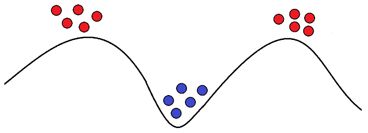
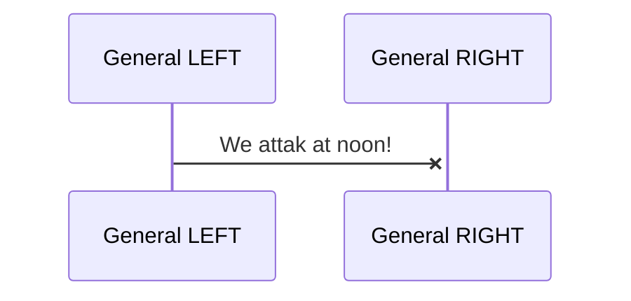
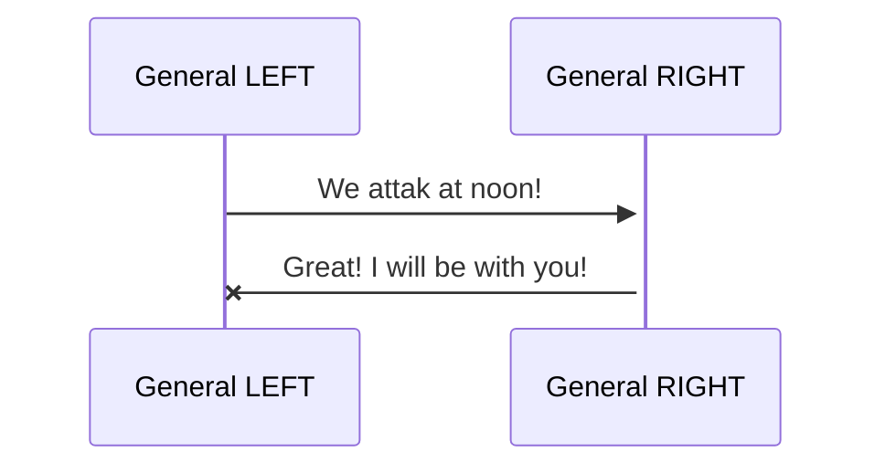
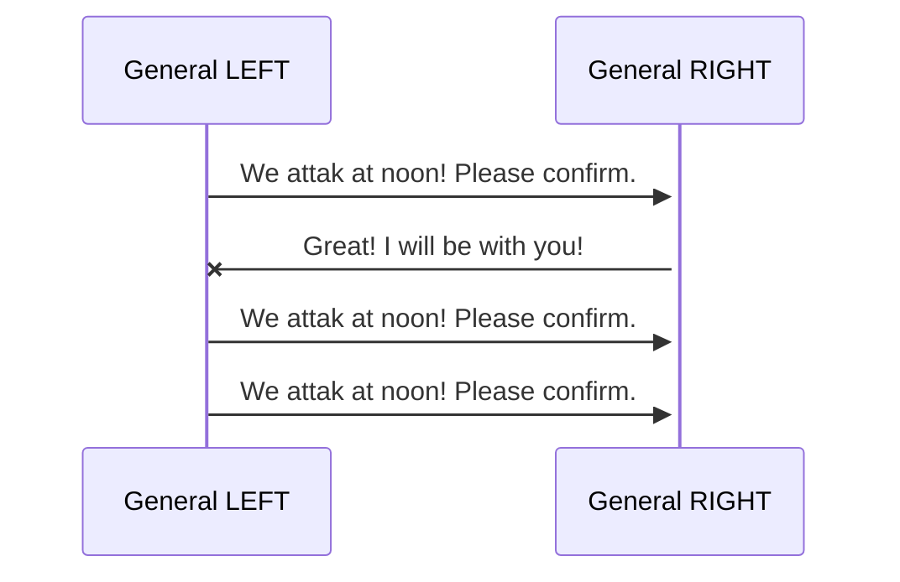

# The two generals - The problem

> [!TIP]
> inspired by https://blog.bulloak.io/post/20200910-two-generals-problem/

Two armies (red and blue). The blue one is in a vally and on opposite mountains the red one is deployed with one general for ervery side.

Goal: red must start one combined attak of blue to win

Problem: how to establish a secure communication between these two generals / armies to be sure both armies attak at the same time

The communication only works with messengers, which must be send through the hostile valley.

Risk: messengers could be caught, compromised, exchanged, ...

> [!CAUTION]
> **How should the protocol look like to ensure the communication?**

## Example

> [!TIP]
> Try diagrams by yourself (the examples in this readme are working in the preview): \
> https://mermaid.live/edit\
> VSCode Plugin: https://marketplace.visualstudio.com/items?itemName=MermaidChart.vscode-mermaid-chart\

How can the generals be sure, that the messeges went through?

What, if an answer is expected but never received?

